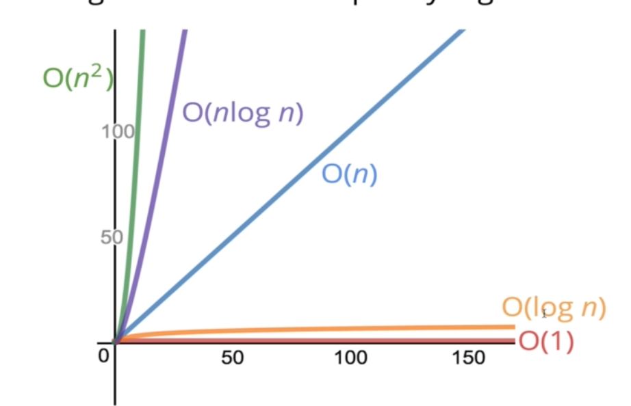

## Topics
> In this section we will learn about Big O Notation
* Time Complexity and Space complexity
* Evaluate the time complexity and space complexity of different algorithms using Big O Notation
* Describe what algorithm is 

## Notes

### Big O Notation
It's a system, it's a way of generalizing code and talking about it and comparing code and it's performance to other piece of code.

#### Timing Our code
> Suppose we want to write a function that calculate the sum of all number from 1 up to (and including) some number n.

```
//first solution

function addUpTo(n) {
  let total = 0;
  for (let i = 1; i <= n; i++) {
    total += i;
  }
  return total;
}

console.log(addUpTo(100))

//Expected output: 5050

```

```
//second solution

function addUpTo(n) {
  return n * (n + 1) / 2;
}

console.log(addUpTo(6))
```

> What does better mean
* Faster?
* Less memory-intensive?
* More readable?

> Faster?
```
//Faster algorithms
function addUpTo(n) {
  return n * (n + 1) / 2;
}

var time1 = performance.now();
addUpTo(1000000000);
var time2 = performance.now();

console.log(`Time Elapsed: ${(time2 - time1) / 1000} seconds.`)

//Expected output: Time Elapsed: 0 seconds.
```

```
// Slower algorithm
function addUpTo(n) {
  let total = 0;
  for (let i = 1; i <= n; i++) {
    total += i;
  }
  return total;
}


var t1 = performance.now();
addUpTo(1000000000);
var t2 = performance.now();
console.log(`Time Elapsed: ${(t2 - t1) / 1000} seconds.`)

//Expected output: Time Elapsed: 1.1001999999880792 seconds.

```

#### The Problem with time
* Different machine will record different times
* The same machine will record different times
* For fast algorithms, speed measurement may not be precise enough?

### if not time, then what?
* Rather than counting seconds, which so variable
* Let's count the number of simple operations the computer has to perform

#### Counting Operations

```
function addupTo(n){
    return n * (n+ 1)/ 2;
}
```
> On the above code, there number of operation (1 multiplication), (1 addition) and (1 division)

```
function addUpTo(n) {
  let total = 0;
  for (let i = 1; i <= n; i++) {
    total += i;
  }
  return total;
}
```

> On the above code, there n operation which are done on different operation

#### Counting is hard
Depending on what we count, the number of operation can be as low as 2n or as high as 5n + 2

But regardless of the exact number, the number of operations grows roughly proportionally with n.

> So in this case as  `n` grows the number of operations grow roughly in proportion with `n`

### Introducing Big O

`Big O Notation` is a way to formalize fuzzy counting

It allows us to talk in a very formal way about how the runtime of an algorithm grows as the inputs grow.

> It's a way fo describing the relationship between the input to a function as it grows and how that changes the runtime of that function.
>
> The relationship between the input size and then the time relative to that input

#### Big O Definition

We say that an algorithm is `O(f(n))` if the number of simple operations the computer has to do is eventually less than a constant time `f(n)`, as n increase.

* f(n) could be linear (f(n)=n)
> So it could be linear meaning that as `n` input scales , the runtime scales as well 
* f(n) could be quadratic (f(n)=n^2)
> It could be quadratic meaning, whereas  as `n` input grows, the run time is related to the Square of `n`
* f(n) could be constant (f(n)=1)
> It could be constant, as `n` input grows, it doesn't really have an impact because runtime is always constant which is simply down to one.
* f(n) could be something entirely different!

> Example

```
function addUpTo(n) {
  return n * (n + 1) / 2;
}
```

Based on the above function (Always 3 Operation) is `O(1)`, which tells us that as `n` grows as `input` to this function grows, it has no `change` in the runtime.

```
function addUpTo(n) {
  let total = 0;
  for (let i = 1; i <= n; i++) {
    total += i;
  }
  return total;
}

```
`Number of operations is (eventually) bounded by a multiple of n(say, 10n)`,`O(n)`

Based on the above function which has a bunch of operations that are happening where we said tht it grows as n grows, the runtime grows basically in a 1 to 1 ratio, the number of operations is eventually bounded by a multiple of `n` and it doesn't actually matter if it's 1n or 5n or 10n or 15n because at the end of the day we simplify it down just to n.

#### Another Example

```
function countUpAndDown(n){
    console.log('Going up!')
    for(let i=0; i<n;i++){
        console.log(i)
    }
    console.log("At the top!\nGoing down...");
    for(let j = n-1;j>=0;j--){
        console.log(j)
    }
    console.log('Back down. Bye!')
}

//Expected output:
Going up!
0
1
2
3
4
5
6
7
8
9
At the top!
Going down...
9
8
7
6
5
4
3
2
1
0
Back down. Bye!
```

```
  for(let i=0; i<n;i++){
        console.log(i)
    }
```

So for the above code as `n` grows, we have roughly `n` operation to have a loop. So there's a `O(n)` because this as `n` grows this loop grows as well.

```
  for(let j = n-1;j>=0;j--){
        console.log(j)
    }
```
So for the above code, is the same as the previous above code, as `n` grows, this loops grows as well. It's just doing the same thing as previous loop but is going back down.

> Number of operation is (eventually) bounded by a multiple of n ( say, 10n)

So you might think the big n, its 2n. But remember that we don't care about that, we care about the big picture. So we simplify it to `O(n)`

#### OMG MOAR EXAMPLEZ

```
function printAllPairs(n){
    for (let i =0; i<n; i++){
        for (let j = 0; j<n; j++){
            console.log(i,j)
        }
    }
}
printAllPairs(2)

//Expected output:
0 0
0 1
1 0
1 1
```


```
   for (let i =0; i<n; i++){
    ....
    }
```
`O(n)` Based on the above code, the loop is based on `n` that mean `O(n)`, as `n` grows, this is going to be `n` number of operations.


```
//the nested loop
for (let j = 0; j<n; j++){
            console.log(i,j)
        }
```

`O(n)`, which is the same thing as the above code. `O(n)` which just means that as `n` grows, on this loop, the number or times it run grows as well.

`O(n)` operations inside of an `O(n)` operation, that gives us something else, an `O(n)` operation inside an `O(n)` operation give as `O(n*n)` which is `O(n^2)`

So what this means is that as `n` grows the runtime grows at the rate of `n^2`

> This is just a generalized way for talking about how efficient an algorithm is as an input `n` grows, how does that change to reflect in the runtime.

### Simplifying Big O Expressions

When determining the time complexity of an algorithm, there are some helpful rule of thumbs for big O expressions.

These rules of thumb are consequences of the definition of big O notation.

#### Constants Don't Matter
* `O(2n)` we simplify that just to `O(n)`
* `O(500)` we simplify than to `O(1)`
> `O(500)`is basically saying there are 500 operations every time no matter what `n` is.
* `O(13n^2)` we just simplify it to `O(n^2)`

#### Smaller Terns Don't Matter
* `O(n + 10)` is just `O(n)`
* `O(1000n + 50)` is just `O(n)`
* `O(n^2 + 5n +8)` is just `O(n^2)`

#### Big O Shorthands
* Analyzing complexity with big O can get complicated.
* There are several rules of thumb that can help
* These rules won't `Always work`, but are a helpful starting point.
> 1. Arithmetic operations are constant
> 2. Variable assignments are constant
> 3. Accessing elements in an array (by index) or object(by key) is constant
> 4. In a loop, the complexity is the length of the loop times the complexity of whatever happens inside of the loop
    > But then whatever happens inside that loop is also consequential because if we have nested loops as we've seen then we end up with potentially `n` squared runtime.
#### A Couple More Examples
```
function logAtleast5(n){
    for (let i = 1; i<=Math.max(5,n); i++){
        console.log(i)
    }
}


logAtleast5(3)

//Expected output:
1
2
3
4
5
```

So if I give it three we still get five but if I give it seven we get seven printed out one two three up to seven

And what we care about is what happens when `n` grows larger, So if `n` continues to grow  towards infinity. What happens to the runtime.

So if `n` is `10 million` this loop is going to run 10 million times.

So we can just simplify this and say that the big O of this is `O(n)` and because if `n` grows  the number of operations grows in proportion with `n`.

```
function logAtMost5(n){
    for(let i= 1; i<= Math.min(5,n); i++){
        console.log(i)
    }
}

logAtMost5(30)

//Expected output:
1
2
3
4
5
```

The above code: So it's going to take whatever is smaller if I give it a a larger number, if it's larger than 5 it's going to log 5. If I give it something less than 5 then it will log until that value. Positive value only, negative value, it doesn't do anything.

As `n` grows it doesn't matter because we're going to take the min which is five, so if `n` is approaching to infinity, this loop runs five times only.

If `n` is two then the loop runs five times.

We can simplify this by saying that if `n` grows which is what we care about, the big O of this is constant `O(1)`.


### Space Complexity
So far, we've been focusing on `time complexity:` how can we analyze the runtime of an algorithm as the size of the input increase?

We can also use big O notation to analyze `space complexity` how much additional memory do we need to allocate in order to run the code in our algorithm?

#### What about the inputs?

Sometimes you'll hear the term `auxiliary space complexity` to refer to space required by the algorithm, not including space taken up by the inputs.

Unless otherwise noted, when we talk about space complexity, technically we'll be talking about auxiliary space complexity.

Basically it just means we're focusing on what  happens inside the algorithm.

#### Space Complexity in Js

Rule of Thumb
* Most primitive (booleans, numbers, undefined, null) are constant space.
* Strings require `O(n)`space (where n is the string length)
* Reference type are generally `O(n)`, where `n` is the length (for arrays) or the number of keys (for objects)

#### An Example
```
function sum(arr){
    let total = 0;
    for(let i=0; i<arr.length; i++){
        total += arr[i];
    }
    return total;
}

console.log(sum([5,5]))

//Expected output: 10
```
So here we're focusing on not time complexity, we're focussing on space complexity.

No matter what the array length is we have one variable called `total` . And the we have a second declaration inside the `for loop` which is `let i=0`, and that's it for space.

We're coming back to the total variable, we're adding into it but that doesn't matter, that takes time, but the space is already there.

No matter what the size of the array is, as it grows might be thousand items or it might be a million items.It doesn't have an impact on the space that's taken up because we only have these `two variables` and they exist no matter what.

We're not adding new variables based of the length, we are adding to the `total variable`,but we're not making a new variable.

so that really just means we have constant space `O(1)` space. It's always the same no matter the size of the input.

> Another Example

```
function double(arr){
    let newArr = [];
    for(let i = 0; i<arr.length; i++){
        newArr.push(2*arr[i]);
    }
    return newArr;
}

console.log(double([2,4,8]))

//Expected output:[ 4, 8, 16 ]
```
So what does that mean for the space complexity of this, as the array length grows,as the input approaches infinity. 

We can simplify it down just to the level of `O(n)`

### Logarithms

We've encountered some of the most common complexities : `O(1), O(n), O(n^2)`

Sometimes big O expression involve more complex mathematical expressions.

One that appears more often than you might like is logarithm!

#### Wait, what's a log again?

`Logarithm` is the inverse of exponentiation.

Just like division and multiplication are a pair, logarithms and exponent are pair.

`log2 (8) = 3` You would read this as log base two of eight equal three.

#### Wut

This isn't math course, so here's a rule of thumb.

The logarithm of a number roughly measure the number of times you can divide the number by 2 `before you get a a value that's less than or equal to one`.

#### Logarithm Examples
8
8/2 = 4,
4/2 = 2
2/2 = 1

So log(8) = 3

25
25/2 = 12.5
12.5/2 = 6.25
6.25/2 = 3.125
3.125/2 = 1.5625
1.5625/2 = 0.78125

log(25) = 4.65

#### Logarithm Complexity

Logarithm time complexity is great!

Logarithm time complexity is greater if you have an algorithm with `O(log n)`, time complexity

#### Who Cares?

Certain search algorithms have logarithmic time complexity.

Efficient sorting algorithms involve logarithms. So not all sorting algorithms but some of the more efficient ones do.

Recursion sometimes involves logarithmic space complexity.

## Summary

* To analyze the performance of an algorithm, we use Big O Notation.
* Big O Notation can give use a high level understanding of the time or space complexity of an algorithm
* Big O Notation doesn't care about precision, only about general trends (linear? quadratic? constant?)
* The time or space complexity (as measured by Big O) depends only on the algorithm, not the hardware used to run the algorithm
* Big O Notation, everywhere, so get lots of practice!

### Resources
[Performance Tracker](https://rithmschool.github.io/function-timer-demo/)



